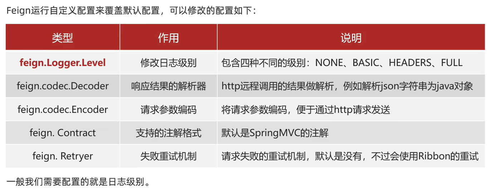
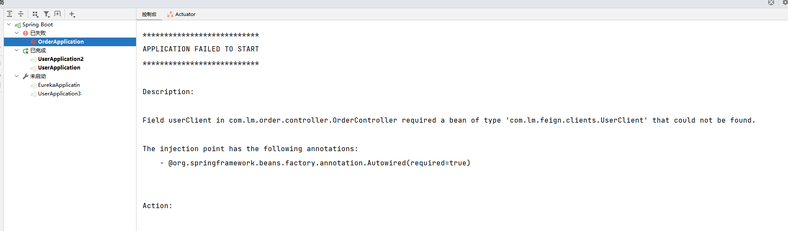

# 目录
[toc]
## 写在前面
搭建测试项目各版本：
```
    Maven：4.0.0
    jdk：1.8
    Spring boot：2.3.12.RELEASE（3.0以上不再支持jdk8；）
    Springcloud：Hoxton.SR12（sr5以下Spring boot可用2.2.x; sr5及以上用Spring boot2.3.x）
    Mysql：8.0.33
    Mybatis：2.1.1
    Nacos：2.0.3（注意与1.0搭建集群时的配置区别）
    Nginx：1.24.0
```

## 一、远程调用
RestTemplate | Feign远程调用
---|---
Http请求 | 声明式、基于SpringMVC注解


### 1. RestTemplate
- 配置使用步骤（消费者微服务）：
    1. 注册：在启动文件中配置RestTemplate方法 使用@Bean注册为bean
        ```
            @Bean
            public RestTemplate restTemplate(){
                return new RestTemplate();
            }
        ```
    2. @Autowired依赖注入controller
        ```
            @Autowired
            private RestTemplate restTemplate;
        ```
    3. 调用get/post相关方法获取http返回值
        ```
            String url = "http://userservice/user/"+order.getUserId();
            User user = restTemplate.getForObject(url, User.class);   //将结果自动封装为user类
        ```

### 2. Feign
#### 2-1 Feign远程调用
feign内部已经封装了ribbon（==**注**：nacos负载均衡也是配置再ribbon下，所以ribbon和nacos的负载均衡规则不会冲突==），所以会自动实现服务的负载均衡
- 配置使用步骤（消费者微服务）：
    1. 引依赖
        ```
                <!-- feign客户端依赖 -->
                <dependency>
                    <groupId>org.springframework.cloud</groupId>
                    <artifactId>spring-cloud-starter-openfeign</artifactId>
                </dependency>
        ```
    2. 启动类添加注解，启动feign注解自动装配
        ```
        @MapperScan("com.lm.user.mapper")
        @SpringBootApplication
        @EnableFeignClients//开启feign的自动装配
        public class OrderApplication {
        
            public static void main(String[] args) {
                SpringApplication.run(OrderApplication.class, args);
            }
        }
        ```
    3. 编写feign客户端接口（最好单独建feign客户端包（clients）方便管理）
        ```
            /**
             * feign 远程调用
             */
            @FeignClient("userservice")
            public interface UserClient {
                @GetMapping("user/{id}")
                User findById(@PathVariable("id") Long id);
            }
        
        ```
    4. 使用Client接口实现http请求
        ```
        @RestController
        @RequestMapping("order")
        public class OrderController {
        
            @Autowired
            private OrderService orderService;
        
            //@Autowired
           // private RestTemplate restTemplate;
        
            @Autowired
            private UserClient userClient;
        
            @GetMapping("{orderId}")
            public Order queryOrderByid(@PathVariable("orderId") Long orderId){
        
                Order order = orderService.queryOrderById(orderId);
                //feign实现远程调用
                User user = userClient.findById(order.getUserId());
                
                //restTemplate远程调用
                // String url = "http://userservice/user/"+order.getUserId();
                // User user = restTemplate.getForObject(url, User.class);
        
                //封装user到order
                order.setUser(user);
                return order ;
            }
        }
    
        ```
#### 2-2 Feign自定义
1. 自定义类型：
2. 自定义日志配置方式
    1. 配置文件方式
        ```
            feign:
          client:
            config:
        #      default: #Feign日志文件 全局 配置
              userservice: #Feign日志文件 局部 配置 对某个微服务生效
                loggerLevel: FULL #日志文件类型
        ```
    2. java代码方式
        1. 先声明一个logger的bean（建议放config包下单独管理）
            ```
            /**
             * feign日志配置注解形式要先声明一个Logger.Level作为bean
             */
            public class FeignClientConfiguration {
                @Bean
                public Logger.Level feignLogger(){
                    return Logger.Level.BASIC;//日志类型为basic
                }
            }
            ```
        2. 通过对启动类（或Feign客户端接口类）添加注解配置全局（或局部）自定义bean生效
            ```
            1. 启动类修改注解：@EnableFeignClients(defaultConfiguration = FeignClientConfiguration.class)//开启feign的日志全局配置
            2. Feign客户端接口修改注解：@FeignClient(value = "userservice", configuration = FeignClientConfiguration.class)//feign日志文件局部配置
            ```
#### 2-3 feign性能优化
- 从底层客户端实现优化
    1. URLConnection：默认实现，不支持连接池
    2. Apache HttpClient ：支持连接池
        1. 引依赖：消费者微服务中引入httpclient依赖
            ```
             <!-- 为feign引入httpclient依赖 -->
                    <dependency>
                        <groupId>io.github.openfeign</groupId>
                        <artifactId>feign-httpclient</artifactId>
                    </dependency>
            ```
        2. 修改配置文件：修改消费者对`feign.httpclient`的配置
            ```
            feign:
              httpclient:
                enabled: true #开启对htttpClient的支持
                max-connections: 200 #最大连接数
                max-connections-per-route: 50 #每个路径的最大连接数
            ```
        3. OkHttp：支持连接池
- 从日志级别设置优化
    1. 尽量不使用full级别日志（调试错误时可以使用该级别）
    2. 日常一般使用basic或none级别即可

#### 2-4 feign最佳实践分析
企业实践出来相对较好的Feign使用方式
1. 继承：给消费者的FeignCLient与提供者的Controller定义统一的父接口最为标准
    - 面向契约编程
    - 但服务紧耦合
    - 且SpringMVC不生效父接口参数，即父接口参数列表中的映射不会被继承（如：参数注解@PathVariavle注解），需要本地重新自定义出来
2. 抽取：将FeignClient抽取为独立模块，并且把接口相关的pojo、默认的feign配置都放到该模块下，提供给所有服务使用（通过引用依赖进行使用）
    - 耦合度低
    - 代码模块清晰
3. 以抽取方式实现最佳实践步骤：
    1. 创建新模块 如：feign-api，引入Feign客户端依赖等需要的依赖
    2. 创建其他服务需要的feign远程调用的client接口及各实体类
    3. 修改或导入其他服务中的重复配置及实体类为Feign下的类，并引入以下自定义的依赖
        ```
                <!-- 抽出feign-api 引依赖 -->
                <dependency>
                    <!--    抽取出的自定义feign模块的组id    -->
                    <groupId>com.lm</groupId>
                    <!--    自定义模块名 feign-api    -->
                    <artifactId>feign-api</artifactId>
                    <version>1.0-SNAPSHOT</version>
                </dependency>
        ```
- 当定义的FeignClient不在消费者服务启动类的扫描包范围内时，这些FeignClient的bean则无法成功注入进行使用。如下图报错：。解决方案：
    1. 启动类中指定feignclient所在包
        ```
        @EnableFeignClients(basePackages = "com.lm.feign")//feign抽出后扫描feign下所有包
        ```
    2. 启动类中指定feignClient字节码
        ```
        @EnableFeignClients(clients = UserClient.class)//feign抽出后只指定扫描feign下需要的客户端包
        ```

---


## 二、注册中心

Eureka| Nacos
---|---
AP | AP+CP
Ribbon | Ribbon

### 1. Eureka注册中心（AP）
Eureka-server  | Eureka-client
---|---
记录微服务信息 | 各个微服务

- ==服务端==配置使用步骤：
    1. 创建模块项目
    2. 引依赖: ` spring-cloud-start-netflix-eureka-server`
        ```
           <!--eureka服务端依赖-->
           <dependency>
              <groupId>org.springframework.cloud</groupId>
              <artifactId>spring-cloud-starter-netflix-eureka-server</artifactId>
           </dependency>
        ```
    3. 添加配置文件 编写eureka配置
        ```
            server:
              port: 10086 #eureka端口号
            spring:
              application:
                name: eurekasever #服务器名称
            eureka:
              client:
                #设置注册中心的地址，访问地址localhost:10086
                service-url:
                  defaultZone: http://localhost:${server.port}/eureka/
                server:
                  # 是否启用自我保护机制
                  enable-self-preservation: false
        ```
- 客户端配置使用步骤
    1. 引依赖
        ```
                <!--eureka客户端依赖-->
                <dependency>
                    <groupId>org.springframework.cloud</groupId>
                    <artifactId>spring-cloud-starter-netflix-eureka-client</artifactId>
                </dependency>
        ```
    2. 配置文件中添加配置
        1. spring.application.name配置服务名称
        ```
          application:
            name: userservice #eureka服务名称
        ```
        2. 配置eureka的相关信息
        ```
            eureka:
              client:
                #设置注册中心的地址，注意加空格，访问地址localhost:10086
                service-url:
                  defaultZone: http://127.0.0.1:10086/eureka/
        ```
### 2. Riobbon负载均衡
*微服务在注册中心中拉去服务并进行负载均衡（Ribbon实现），最终确定使用哪个实例*
- 配置使用步骤：
    1. 修改微服务消费者中业务逻辑代码中的url，用微服务提供者的服务名代替端口号（因为一个服务可能有多个实例，端口号也不一定唯一，配置为指定端口号显然不显示）
        ```
            String url = "http://localhost:8081/user/"+order.getUserId(); //8081是userservice的端口号
                                            ↓
            String url = "http://userservice/user/"+order.getUserId();
        ```
    2. 在微服务消费者启动类中的RestTemplate方法上添加负载均衡注解
        
        ```
            @Bean
            @LoadBalanced //负载均衡注解
            public RestTemplate restTemplate(){
                return new RestTemplate();
            }
        ```
- Ribbion实现负载均衡原理
```
sequenceDiagram
Ribbon->>Eureka_server: 请求拉取指定微服务的服务列表
Eureka_server->>Ribbon: 请求列表
```
Ribbon会根据规则选择处一个实例进行响应（默认是`轮询`规则）
- 通过IRule实现修改负载均衡规则
    1. 代码方式：在消费者微服务的启动类中直接重写IRule方法（自定义后消费者微服务再使用的所有微服务规则都会改变）
        ```
            @Bean  //全体微服务都会改变为自定义的负载均衡方式
            public IRule RandomRule(){
                return new RandomRule();
            }
        ```
    2. 配置方式：在配置文件中添加新的配置，配置指定一个或几个提供者微服务的注册微服务名（eureka中注册）（只对某个或某些提供者微服务调用时起作用）
        ```
            userservice: #对该微服务的调用进行Ribbon的负载均衡重定义
              ribbon:
                NFLoadBalancerRuleClassName: com.netflix.loadbalancer.RandomRule #负载均衡规则
        ```
    - 拓展：懒加载和饥饿加载
        1. 懒加载：Ribbon默认。第一次访问时才会创建LoadBalaceClient，所以第一次访问耗时相比之下会很长
        2. 饥饿加载：会在服务项目启动时创建，降低第一次访问耗时
        - 只需要更改该微服务配置文件中配置即可，配置如下：
            ```
            ribbon:
              eager-load:
                enabled: true #是否开启饥饿加载
                clients: userservice #提供者微服务注册名，指定对某个或某些提供者微服务进行饥饿加载
            ```
### 3. Nacos
#### 3-1. Nacos注册中心（CP+AP）
- 注：属于Spring配置
0. 准备工作： 
    1. 下载Nacos （按需求可以更改Nacos端口号，默认8848）
        - GitHub主页：https://github.com/alibaba/nacos
        - GitHub的Release下载页：https://github.com/alibaba/nacos/releases
    2. 运行: 在Nacos的bin目录下cmd并执行`startup.cmd -m standalone`命令通过非集群方式启动（nacos默认是集群方式启动）
1. 父工程配置使用步骤
    1. 引依赖
        ```
         <!--nacos的管理依赖-->
                    <dependency>
                        <groupId>com.alibaba.cloud</groupId>
                        <artifactId>spring-cloud-alibaba-dependencies</artifactId>
                        <version>2.2.7.RELEASE</version>
                        <type>pom</type>
                        <scope>import</scope>
                    </dependency>
        ```
        且注释掉Eureka的依赖
2. 子工程（各个微服务）配置使用步骤
    1. 引依赖
        ```
                <!-- nacos客户端依赖包 -->
                <dependency>
                    <groupId>com.alibaba.cloud</groupId>
                    <artifactId>spring-cloud-starter-alibaba-nacos-discovery</artifactId>
                </dependency>
            </dependencies>
        ```
        且注释掉Eureka的依赖
    2. 修改配置文件: spring.cloud.nacos.server-addr
        ``` 
          cloud:
            nacos:
              server-addr: localhost:8848 #Nacos的端口号
        ```
        且注释掉Eureka的配置
- Eureka和Nacos注册中心对比
    - ribbon等配置两者通用
    - 两者的细节对比
        ```
        sequenceDiagram
        消费者微服务->>服务列表: 保存拉取下来的信息
        消费者微服务->>注册中心: 定时拉去服务(pull)[Eureka、Nacos]
        注册中心->>消费者微服务: 主动推送变更消息(push)[Nacos] =>消息更新的更及时
        提供者微服务->>注册中心: 注册服务信息[Eureka、Nacos]
        提供者微服务->>注册中心: 30s心跳检测[Eureka、Nacos的临时实例]
        注册中心->>提供者微服务: 主动询问[Nacos的非临时实例]
        消费者微服务->>提供者微服务: 远程调用
        ```
    - Nacos非临时实例配置（在该服务的配置文件配置即可）
        ```
          cloud:
            nacos:
              server-addr: localhost:8848
              discovery:
                ephemeral: false #是否为临时实例，默认为true
        ```
        无特殊需求推荐使用临时实例，会一定程度降低服务运行压力
#### 3-2. Nacos服务多级存储模型
- 服务级别（从上到下级别从低到高）
    1. 服务：例如userservice
    2. 集群：例如上海或者杭州
        1. 配置各个微服务：在配置文件（.yml）中配置`spring.cloud.nacos.discovery.cluster-name`属性即可
            ```
              cloud:
                nacos:
                  server-addr: localhost:8848
                  discovery:
                    cluster-name: SH #集群名称 如：SH为上海
            ```
        2. 修改消费者微服务的负载均衡规则为NacosRule（优先同集群，集群内随机）
            ```
            userservice: #对该微服务的调用进行ribbon 的负载均衡重定义
              ribbon:
                NFLoadBalancerRuleClassName: com.alibaba.cloud.nacos.ribbon.NacosRule # 负载均衡规则 com.netflix.loadbalancer.RandomRule(随机访问)/ com.alibaba.cloud.nacos.ribbon.NacosRule(Nacos集群)
            ```
    3. 实例：例如在杭州机房的某台部署了userservice的服务器
#### 3-3. 负载均衡
1. 可在优先同集群，集群内随机的基础上添加权重实现Nacos的权重负载均衡
    1. 在Nacos的后台控制界面中选择相对性的提供者微服务，点击“编辑”按钮，填写权重值保存即可
    2. 权重值可以为：0-1（==权重为0则完全不会访问==）
2. 可用于实现“不停服维护”之类的开发操作

#### 3-4. 环境隔离-namespace（最外层/最高隔离级别）
```
    graph LR
    namespace-->group
    group-->service/data
    service/data-->集群
    集群-->实例
```
1. 在Nacos后台界面新建命名空间，填写命名空间名和描述信息，命名空间ID自动生成即可
2. 在微服务的配置文件中添加namespace配置`spring.cloud.nacos.discovery.namespace`即可（注：配置==填写命名空间ID==而不是命名空间名）
    ```
      cloud:
        nacos:
          server-addr: localhost:8848
          discovery:
            namespace: 02abc9ce-8f77-4132-b105-74f36e0267fa # 命名空间ID
    ```
#### 3-5. Nacos配置管理
1. 统一配置管理
- 配置更改热更新
- bootstrap.yml的加载在application.yml之前
```
graph LR
项目启动-->读本地配置application.yml
项目启动-->读取bootstrap.yml其加载顺序优先级高于在本地配置
读取bootstrap.yml其加载顺序优先级高于在本地配置-->读本地配置application.yml
读本地配置application.yml-->创建spring容器
创建spring容器-->加载bean
```
2. Nacos配置管理配置使用步骤
    1. 在nacos后台添加配置管理
        1. 配置管理DataID其实就是配置文件名，但是为了区分开，命名格式统一为“微服务名-profile.后缀名”。例如userservice-dev.yaml
        2. 填写描述
        3. 添加后期可能有需求热更新且进行统一配置管理的配置项。 例如：
            ```
            pattern:
                dateformat: yyyy-MM-dd HH:mm:ss
            ```
        4. 完成发布
    2. 在==需要管理的微服务==中进行配置
        1. 引依赖
            ```
                    <!-- nacos配置管理依赖 -->
                    <dependency>
                        <groupId>com.alibaba.cloud</groupId>
                        <artifactId>spring-cloud-starter-alibaba-nacos-config</artifactId>
                    </dependency>
            ```
        2. 创建==bootstrap.yml==文件，并添加配置【微服务名、环境、nacos地址、文件后缀名】
            ```
            spring:
              application:
                name: userservice #服务名
              profiles:
                active: dev #环境
              cloud:
                nacos:
                  server-addr: localhost:8848 #nacos地址
                  config:
                    file-extension: yaml #配置文件的后缀名
            ```
            同时删除该微服务application.yml中的重复配置。
    3. 验证：微服务可通过@Value读取配置，若读取到则为配置成功
        ```
        @RestController
        @RequestMapping("user")
        public class UserController {
            
            @Value("${pattern.dateformat}") //@Value读取配置文件中的值
            private String dateformat;
        
            @GetMapping("now")
            public String now(){
                return LocalDateTime.now().format(DateTimeFormatter.ofPattern(dateformat));//使用自定义的dateformat变量对当前时间进行格式化
            }
        }
        ```
        此时还为实现配置管理的热更新，还需要重启服务才能更新
    4. 实现配置管理的**热更新**
        1. 在使用@Value的所在==类==上添加`@RefreshScope`注解即可
        ```
        @RestController
        @RefreshScope //实现热更新
        @RequestMapping("user")
        public class UserController {
          
            @Value("${pattern.dateformat}")
            private String dateformat;
            @GetMapping("now")
            public String now(){
                return LocalDateTime.now().format(DateTimeFormatter.ofPattern(dateformat));
            }
        }
        ```
        2. 使用`@ConfigurationProperties`注解实现（**==推荐使用，比较灵活==**）
            0. 引入@ConfigurationProperties的springboot注解解释依赖
                ```
                <build>
                        <finalName>app</finalName>
                        <plugins>
                            <plugin>
                                <groupId>org.springframework.boot</groupId>
                                <artifactId>spring-boot-maven-plugin</artifactId>
                    <!--        <version>2.3.5.RELEASE</version>--> //父工程定义则不需要再写版本号
                            </plugin>
                        </plugins>
                    </build>
                ```
            1. 创建管理类（最好单独建立config包下，方便管理）
                ```
                import org.springframework.boot.context.properties.ConfigurationProperties;
                import org.springframework.stereotype.Component;
                
                /**
                 * 实现Nacos统一配置的pattern属性管理
                 */
                @Data
                @Component
                @ConfigurationProperties(prefix = "pattern") //前缀拼接上变量名 和配置文件中一致则会取值
                public class PatternProperties {
                    private String dateformat;
                }
                
                ```
            2. 调用：通过指定properties获取相关属性值
                ```
                @RestController
                @RequestMapping("user")
                public class UserController {
                    @Autowired
                    private UserService userService;
                
                    @Autowired
                    private PatternProperties patternProperties;
                    
                    @GetMapping("now")
                    public String now(){
                        return LocalDateTime.now().format(DateTimeFormatter.ofPattern(patternProperties.getDateformat()));//通过patternProperties.getDateformat()获取配置文件属性值
                    }
                }
                
                ```

3. 多环境配置共享
- 如某些配置在开发、测试、发布等环境中值相同，则可以共享配置
- 微服务会从Nacos中读取多个配置文件`[spring.applicatiom.name]-[spring.profiles.active].yaml`、`[spring.applicatiom.name].yaml`。且无论profile怎么变化，`[spring.applicatiom.name].yaml`一定会被加载，所以共享配置可以写入该配置文件中。
- 配置文件优先级：
    1. Nacos远端配置 > 本地配置
    2. `[spring.applicatiom.name]-[spring.profiles.active].yaml` > `[spring.applicatiom.name].yaml`（Nacos内部配置）
4. Nacos集群的搭建（企业级开发）
    > - ==一个Nacos-client 通过Nginx映射管理多个Nacos结点==
    > - 每个Nacos结点都可以访问同一个MySql集群
- nacos集群配置
    1. 建立名为nacos(1.X版本)/nacos_config(2.X版本)的数据库，并运行nacos安装目录下自带的sql文件(`\conf\nacos-mysql.sql`)进行数据库的构建。
    2. 将nacos安装目录下`/conf/application.properties.example`文件删除`.example`后缀更名为`application.properties`。
    3. 配置`application.properties`
        1. 配置nacos端口
            ```
            #*************** Spring Boot Related Configurations ***************#
            ### Default web context path:
            server.servlet.contextPath=/nacos
            ### Default web server port:
            server.port=8888   #nacos端口号
            ```
        2. 配置数据库类型（解开mysql注释）
            ```
            #*************** Config Module Related Configurations ***************#
            ### If use MySQL as datasource:
            spring.datasource.platform=mysql 
            
            ### Count of DB:
            db.num=1 
            ```
        3. 配置mysql数据库连接
            ```
            ### Connect URL of DB:
            db.url.0=jdbc:mysql://127.0.0.1:3308/nacos_config?characterEncoding=utf8&connectTimeout=1000&socketTimeout=3000&autoReconnect=true&useUnicode=true&useSSL=false&serverTimezone=UTC
            db.user.0=root
            db.password.0=mysql1225
            ```
    4. 配置`cluster.conf`文件:粘贴进去配置的nacos集群ip：端口（2.X版本若使用本机三个不同端口模拟==不能用127.0.0.1代替本机真实ip==，需要用(真实ip：端口号)配置）
            ```
                 192.168.1.19:5555
                 192.168.1.19:7777
                 192.168.1.19:8888
            ```
    5. 使用本机三个不同端口模拟，可通过复制整个nacos文件夹复制三份，分别命名为nacos端口号1、nacos端口号2、nacos端口号3，然后分别更改配置文件`application.properties`中的端口号即可。
    6. 分别使用命令`startup.cmd`启动三个节点即可完成nacos集群配置。（bin目录下通过启动命令`startup.cmd`以集群方式启动）
- Nginx反向代理配置
    1. 下载Nginx并解压在不含中文的目录下。官方下载：`http://nginx.org/en/download.html`
    2. 配置`nginx.conf`文件，在http任意位置添加一下配置
        ```
        http{
            upstream nacos-cluster {
                server 192.168.1.19:8888; #nacos集群各个结点及端口号
                server 192.168.1.19:7777;
                server 192.168.1.19:5555;
            }
        	server{
                listen 81; #nacos反向代理端口号 80端口会被nginx自身占用，所以最好避开80端口，可以用81（不要修改http中nginx自己其他的server的80端口）
        		
                location / {
                    proxy_pass http://nacos-cluster;
                }
            }
        } #http结束
        
        # 若nacos为2.X版本则需要额外配置如下grpc协议监听端口
        # stream与http平级，不要写在http中
        # 需要端口偏移 偏移量为+1000
        stream {
            upstream nacosGrpc {
                server 192.168.1.19:9888;
                server 192.168.1.19:8777;
                server 192.168.1.19:6555;
            }
            server {
                listen 1081;  # nacos反向代理端口号+1000
                proxy_pass nacosGrpc;
            }
        }
        	
        ```
    3. 启动命令：安装目录下cmd通过`start nginx` 或 `start nginx.exe`启动nginx
        ```
        nginx -s reload    #重新加载Nginx配置文件，然后以优雅的方式重启Nginx
        nginx -s stop   #强制停止Nginx服务
        ```

- 项目文件配置
    1. bootstrap.yml文件中配置server-addr(Nacos集群配置Nginx反向代理==必须要配置bootstrap.yml==，否则根本提前加载不进去Nacos集群ip，更无法负载均衡)
        ```
        spring:
          application:
            name: userservice #服务名
          cloud:
            nacos:
              server-addr: localhost:81 #nacos代理地址
        ```
    2. bootstrap.yml常用一般配置项（记得注释掉application.yml中的重复配置项）
        ```
        spring:
          application:
            name: orderservice #服务名
          profiles:
            active: dev #环境
          cloud:
            nacos:
              server-addr: localhost:81 #nacos地址
              config:
                file-extension: yaml #配置文件的后缀名
        ```


